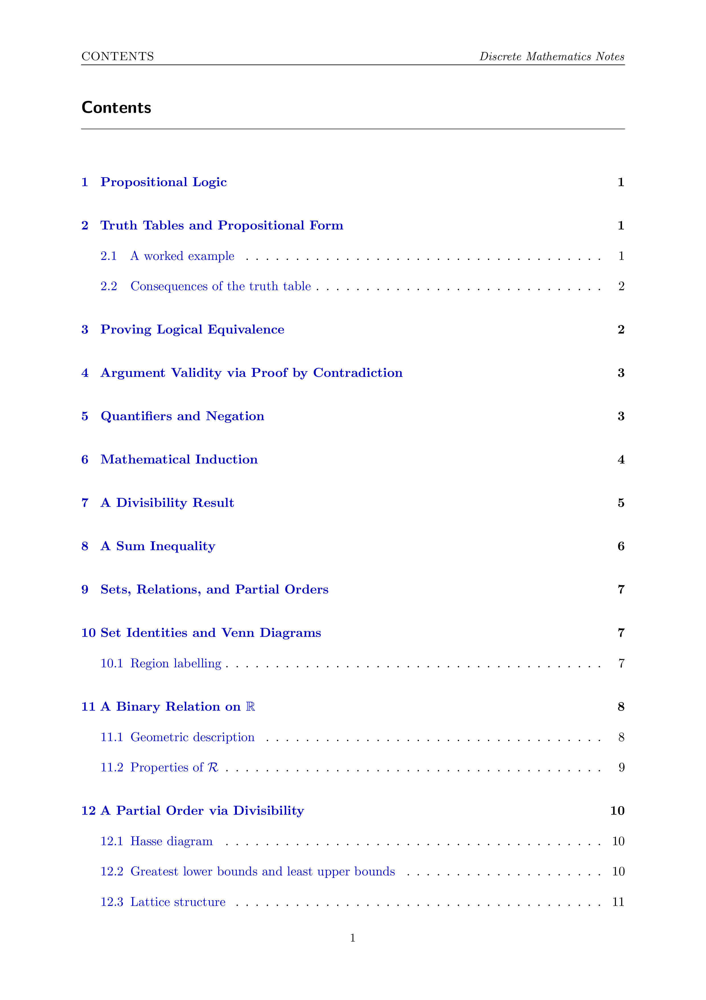
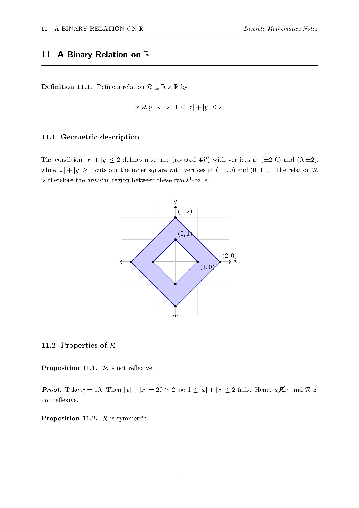
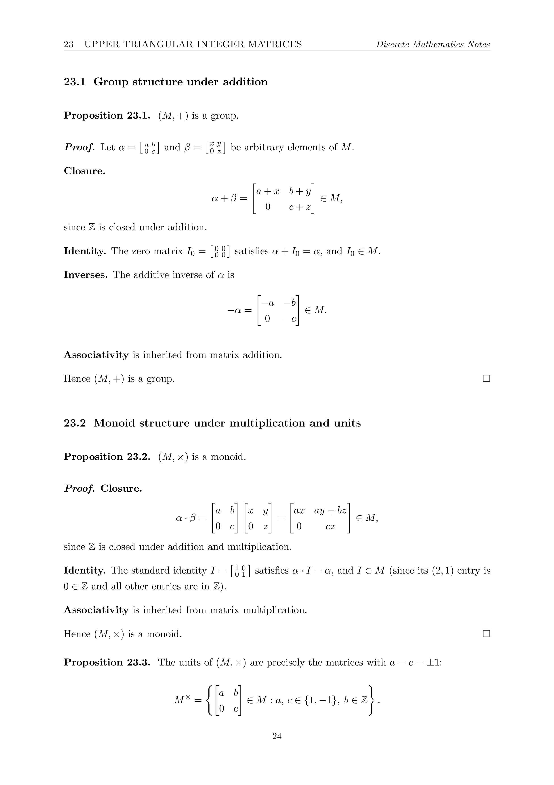

# Discrete Mathematics - Notes and Worked Examples

A structured collection of mathematical notes, proofs, and worked examples covering core topics in discrete mathematics.

The material is organised by topic rather than by assignment, with an emphasis on mathematical reasoning, proof techniques, and clean LaTeX typesetting.

---

## 📘 Preview

<p align="center">
  
  
  
</p>

---

## 📚 Topics Covered

| Folder | Topics |
|--------|--------|
| `logic/` | Propositional logic, truth tables, logical equivalence, quantifiers |
| `induction/` | Mathematical induction, divisibility, inequalities |
| `relations/` | Relations, equivalence relations, partial orders, lattices |
| `functions/` | Injectivity, surjectivity, composition, invertibility |
| `algebra/` | Binary operations, groups, subgroups, cosets, homomorphisms |
| `cryptography/` | RSA cryptosystem, modular arithmetic, Euclidean algorithm |
| `coding-theory/` | Binary linear codes, parity-check matrices, syndrome decoding |
| `graph-theory/` | Graph representations, Eulerian paths, adjacency matrices, cycle structure |

---

## 📌 Prerequisites

This repository assumes familiarity with:

- Basic set theory and notation
- Propositional and predicate logic
- Elementary number theory (divisibility, modular arithmetic)
- Introductory linear algebra (matrices, row reduction)

---

## ⚙️ Building the Documents

Each `.tex` file is self-contained and can be compiled independently.

### Compile a single file:
```bash
latexmk -pdf logic/propositional-logic.tex
```

Build all documents:
```bash
./build.sh
```

Clean auxiliary files:
```bash
find . -type f \( -name "*.aux" -o -name "*.log" -o -name "*.toc" -o -name "*.out" \) -delete
```

## 🧾 Requirements
A TeX distribution (TeX Live or MiKTeX)
latexmk

Common packages used:
amsmath, amssymb, amsthm, amsfonts, geometry, fancyhdr, enumitem, tikz, blkarray, hyperref

All packages are available via standard TeX Live installations.
```bash
📁 Repository Structure
discrete-mathematics-notes/
├── README.md
├── .gitignore
├── build.sh
├── preamble.tex
│
├── logic/
├── induction/
├── relations/
├── functions/
├── algebra/
├── cryptography/
├── coding-theory/
└── graph-theory/
```
🧠 Notes on Content

All material is written in a consistent mathematical style using a shared preamble.

Proofs are fully written out for clarity, even when results are standard.

The focus is on readability, structure, and mathematical reasoning rather than brevity.

---
